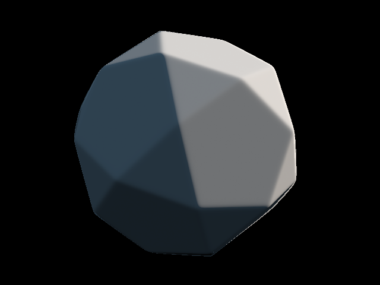
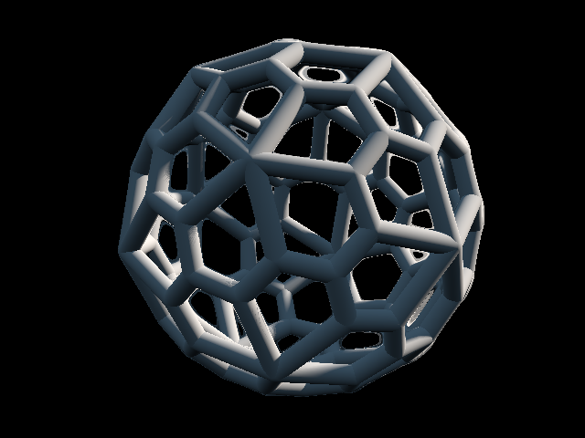

# sdfer
sdfer aims to become a script based CAD.
It runs in the browser, using WASM + WebGL + Shaders.
It is based on implicit functions as described in depth by [iq](https://iquilezles.org/articles/distfunctions/).

## Examples

During development I focused on creating platonics, archimedean and catalan solids.




## Usage

```bash
rustup target add wasm32-unknown-unknown
cargo install trunk
trunk serve
```
